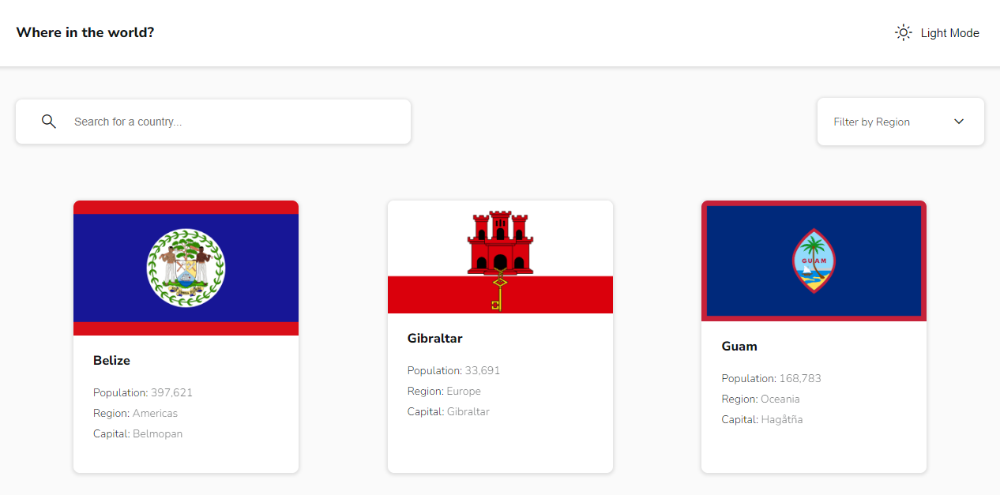

# REST countries API with color theme switcher

A app that consumes [**`REST Countries API`**](https://restcountries.com/) and showcases all countries along with various information, like flag, common name, population, etc.

## 🛠️ Built With

## Design ~ Screenshots

<table>
  <tr>
    <td></td>
    <td></td>
    <td></td>
    <td></td>
  </tr>
</table>
<table>
  <tr>
    <td></td>
    <td></td>
  </tr>
  <tr>
    <td></td>
    <td></td>
  </tr>
</table>

## Authors

👤 **Steven Ntakirutimana**

- GitHub: [@sntakirutimana72](https://github.com/sntakirutimana72)

## 🤝 Contributing

Contributions, issues, and feature requests are welcome!

Feel free to check the [issues page](../../issues/).

## 🫶 Show your support

Give a ⭐️ if you like this project!

## 🤓 Acknowledgments

- [REST Countries API](https://restcountries.com/)

## 📝 License

This project is [MIT](./LICENSE) licensed.
